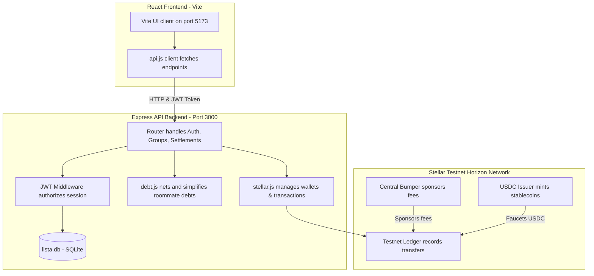

# 🧾 Lista: Your tab. settled.

**Lista** (formerly *Hati*) is a premium, mobile-first roommate expense-sharing and smart settlement application designed for the APAC Stellar Hackathon. 

By combining the **Stellar Blockchain** for stablecoin payments with a **Splitwise-style debt netting engine** and **Google's Gemini API** for receipt scanning, Lista makes splitting household bills, dorm expenses, and trips completely effortless.

---

## 🎨 Premium Design System

Lista features a tailored **Color Hunt** theme built to feel warm, organic, and premium:
* 🌲 **Deep Forest Green** (`#1A312C` / `var(--color-bg)`): Main background colors.
* 🌿 **Teal / Sage Green** (`#428475` / `var(--color-accent)`): Cards, badges, and status borders.
* 🍃 **Mint / Light Teal** (`#89D7B7` / `var(--color-primary)`): Buttons, focus states, and primary actions.
* 🍦 **Warm Cream / Ivory** (`#FFF4E1` / `var(--color-text)`): Clean typography and high contrast layout.

---

## 🏗️ High-Level System Architecture



---

## ⚡ Core Features Built from Scratch

### 1. 🗄️ Database & Schema Design
* Built using Node's native `node:sqlite` module to guarantee C++ compiler-free execution across all development environments (no local node-gyp build locks).
* Normalized schemas mapping relationships between Users, Groups, Group Memberships, Expenses, Settlements, Cash Confirmations, and Nudges.

### 2. 🔐 Authentication & Onboarding
* **Token-based JWT Authorization:** Standard secure bearer authentication gate.
* **Lazy Registrations:** Registers users on-the-fly during their first login via phone, email, or Google accounts.
* **Wallet-Linking:** Associates GCash/Maya/Bank reference tokens on onboarding for simulated fiat integrations.

### 3. 👥 Group & Invite Link System
* **Listahan Creation:** Group management with dynamic invite URL generation using secure UUID slugs.
* **Instant Join Links:** Resolving invite links (`GET /join/:slug`) automatically registers the visitor as a group member, recalculates roommate debts, and returns the group's ledger details.

### 4. 🧮 Smart Split Engine & Debt netting
* **Description Mention Parser:** Regex extracts `@mentions` (e.g., *"@Mark ordered extra rice"*) to automatically configure split participants list.
* **Splitwise-Style Debt Netting:** Greedy netting algorithm that simplifies multi-party roommate debts into the minimal set of user-to-user transactions.

### 5. 💰 Multi-Party Cash Confirmations
* Cash settlements remain in a pending state until **all** involved creditors acknowledge receipt of the funds. Once approvals are complete, the engine recalculates and nets the group balances.
* **Nudge Rate Limiter:** Server-side rate limit enforces a maximum of **1 nudge per user pair per 24 hours** to prevent roommate spam.
* **Auto-Archive Scheduler:** Tracks zero balances, automatically flagging groups for archiving after 7 days of inactivity.

### 6. 🌐 Stellar USDC Stablecoin Payments
* **Automatic Trustlines:** Establishes USDC trustlines to Circle's Testnet issuer (`GBK52A...`) during custodial wallet generation.
* **Sponsored Fee-Bumping:** Wraps inner transactions in an outer fee-bump transaction signed by our central Treasury account. **Users pay zero XLM transaction fees.**
* **Self-Funded USDC Faucet:** Automatically mints and transfers **1,000 USDC** to newly created user accounts on-chain to enable instant testing.

---

## 🛠️ Local Development Setup

### Backend Setup
1. Navigate to the `backend/` directory:
   ```bash
   cd backend
   ```
2. Install dependencies:
   ```bash
   npm install
   ```
3. Create a `.env` file in the `backend/` root directory:
   ```env
   PORT=3000
   JWT_SECRET=supersecretapachatihackathonkey2026
   HORIZON_URL=https://horizon-testnet.stellar.org
   FEE_BUMPER_SECRET= # Optional: Leave blank to generate a temporary funded fee bumper
   ```
4. Run the Express server:
   ```bash
   npm run dev
   ```
5. Run the test suites:
   * **Complete E2E Integration Suite:**
     ```bash
     npm test
     ```
   * **Authentication Verification:**
     ```bash
     node tests/auth_test.js
     ```
   * **Gemini AI Receipt Scan Verification:**
     ```bash
     node tests/gemini_test.js
     ```
   * **Concurrency Stress Testing:**
     ```bash
     node tests/stress_test.js
     ```

### Frontend Setup
1. Navigate to the `frontend/` directory:
   ```bash
   cd frontend
   ```
2. Install dependencies:
   ```bash
   npm install
   ```
3. Start the Vite development server:
   ```bash
   npm run dev
   ```
4. Open `http://localhost:5173` in your browser.

---

## 🔍 On-Chain Verification

You can review a live, fee-bumped USDC stablecoin payment transaction submitted by Lista's smart settlement engine on the Stellar testnet:
* **Stellar Expert URL:** [bcc674bd8a807111df28bc70638776ca720f614595f8111ae8755eeb5fbf3f23](https://stellar.expert/explorer/testnet/tx/bcc674bd8a807111df28bc70638776ca720f614595f8111ae8755eeb5fbf3f23)
