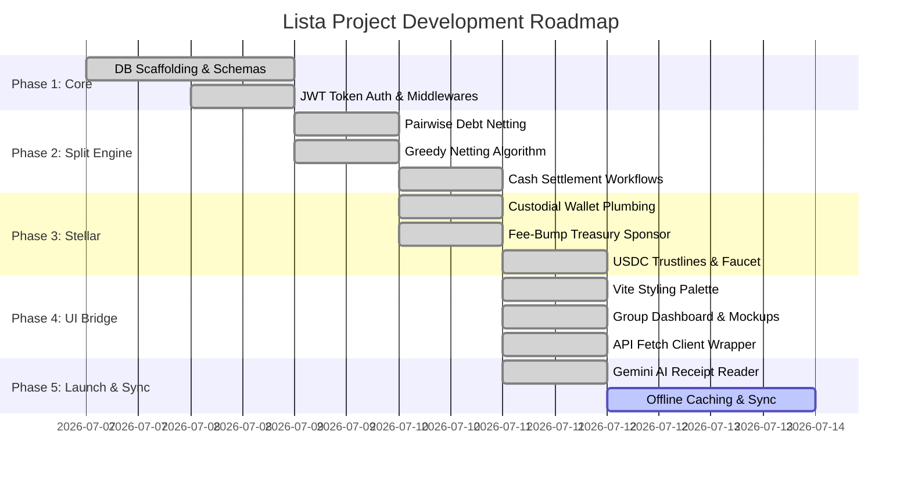

# Project Features Roadmap & Progress Tracker

This document outlines the complete roadmap of features built from scratch for the **Lista** bill-splitting and roommate settlement platform, tracking the milestones achieved by the engineering team.

---

## 📅 Roadmap Overview

---

## 🛠️ Feature Breakdown

### 1. 🗄️ Database & Schema Scaffolding
* **Compile-Free SQLite Configuration:** Configured Node's native `node:sqlite` database module to compile schema models without C++ binary requirements, ensuring portability.
* **Relational Schema Design:** Implemented normalized tables for users, groups, group memberships, bills/expenses, settlements, cash confirmations, and nudge logs.

### 2. 🔐 Authentication & Onboarding
* **Token Auth Gate:** Secured all API routes with a JSON Web Token (JWT) bearer validation middleware.
* **Lazy Auth Logins (`POST /auth/login`):** Automatically registers profiles upon first login using phone numbers, emails, or Google account handles.
* **Wallet-Linking (`POST /users/me/payment-methods`):** Allows users to link GCash, Maya, or Bank reference tokens during onboarding.

### 3. 👥 Group & Invite Link System
* **Listahan Creation (`POST /groups`):** Creates group profiles and sets up membership mappings.
* **Invite Generator (`POST /groups/:id/join-link`):** Generates secure, non-guessable UUID slugs (`https://hati.ph/join/<slug>`).
* **Instant Resolution (`GET /join/:slug`):** Automatically joins the visitor to the group, recalculates the roommate balances, and returns the updated ledger.

### 4. 🧮 Smart Split Engine & Debt Netting
* **Regex Mention Parser (`POST /groups/:id/expenses`):** Reads the description field of bills to parse `@mentions` (e.g. *"@Mark ordered extra rice"*), matching them against database users to calculate split participants automatically.
* **Pairwise Netting:** Computes net balances (paid vs owed) dynamically per group member.
* **Greedy Simplification (`debt.js`):** Simplifies multi-party debts to output the minimal transaction set needed to clear balances (Splitwise-style).

### 5. 💰 Settlement Workflows
* **Cash Settlements & Approvals:** Initiates cash settlements that remain in a pending state. Creditors are prompted to approve cash receipts (`POST /settlements/:id/confirm`), netting debts only when all approvals are recorded.
* **Nudge Rate Limiter (`POST /groups/:id/nudge`):** Implements a strict, server-side rate limit of **1 nudge per user pair per 24 hours** to prevent spam.
* **Auto-Expiration Tracker:** Monitors zero balances dynamically, marking groups for archiving after 7 days of inactivity.

### 6. 🌐 Stellar stablecoin Rails (USDC)
* **USDC Trustlines:** Automatic trustline establishment to Circle's Testnet USDC issuer (`GBK52AWQPRBTEDOYROFVBGVI53KQKNT3HRIZYATUQJT6FNIXR4YTK6LO`) upon custodial wallet generation.
* **Fee-Bump Sponsorship:** Wraps user transactions inside fee-bump transactions sponsored by Hati's Treasury key, keeping gas costs zero for the user.
* **Autonomous Testnet Faucet:** Automatically mints **1,000 USDC** to newly created user accounts during onboarding.
* **On-Chain Settlement:** Submits transactions to the Horizon network and logs transaction hashes.

### 7. 💻 Frontend Bridge & UI Realignment
* **Theme Styling:** Implemented HSL-tailored variables in `index.css` (Dark Forest Green background, Sage Green controls, Mint Green accents, and Warm Cream typography).
* **Mockup Realignment:** Updated `GroupDetail.jsx` with centered headers, side-by-side My Balance cards, date-grouped banners, and initials linked by arrows (`AR ➔ MS`).
* **Detail Accordion:** Adds expandable split breakdown lists showing participants splits.
* **Unified API Helper (`api.js`):** Wraps all backend calls as clean JavaScript promises with automated JWT header injection.

---

## 📈 Current Status & Next Steps

* **Backend API & Stellar Integrations:** 🟢 **100% Complete & Verified.**
* **Design & Frontend Layout alignment:** 🟢 **100% Complete & Verified.**
* **AI Receipt Scanning (Gemini API):** 🟢 **100% Complete & Verified.**
* **Offline Sync & Caching:** 🟡 **In Progress (Scheduled Next).**
