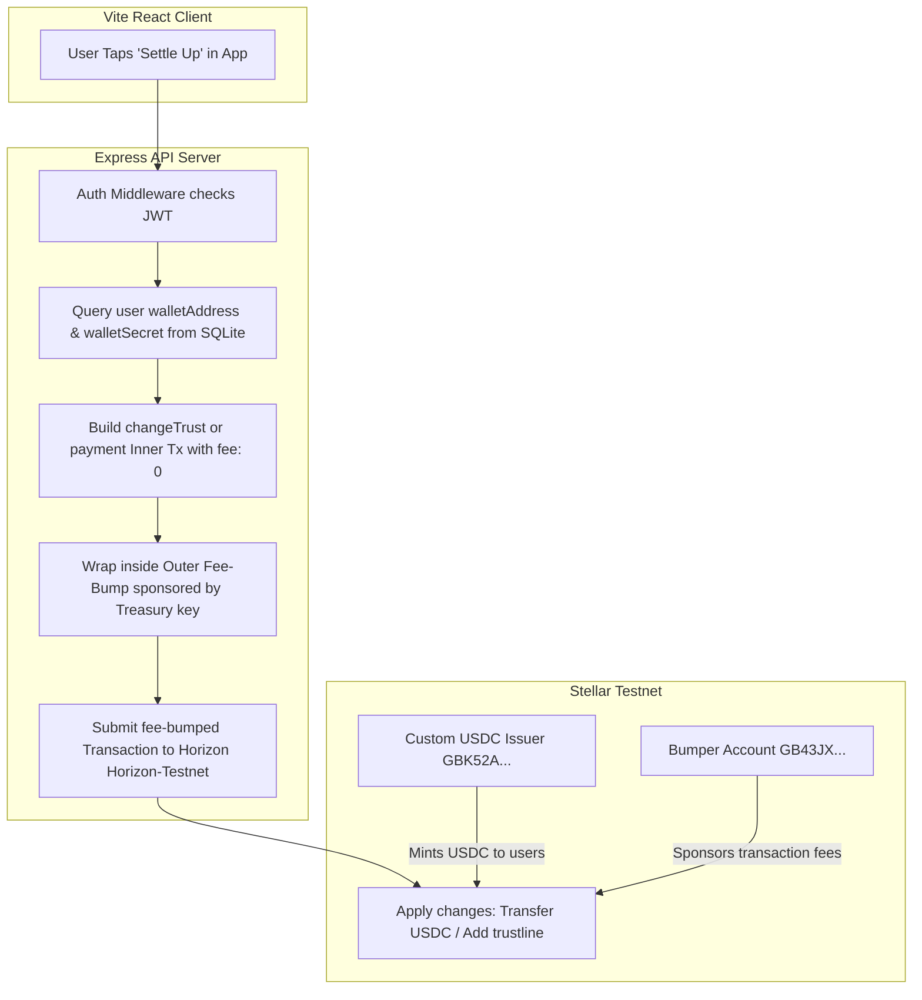

# Stellar USDC Integration & Fee-Sponsorship Architecture

This document details the architectural design, implementation details, and ledger patterns used to power **Lista's** on-chain settlement network using the **Stellar Blockchain**.

---

## 🏗️ Architecture Overview

Lista implements a **custodial wallet model** to eliminate blockchain UX friction (such as seed-phrase management and transaction gas funding). Transactions are sponsored and executed server-side, enabling a seamless one-tap payment flow.

---

## 🧬 Core Blockchain Configurations

### 1. Asset Specifications
To prevent currency volatility and enable stable roommate bill splits, all settlements are transacted in a custom **USDC stablecoin** issued on the Stellar testnet:
* **Asset Code:** `USDC`
* **Issuer Public Key:** `GBK52AWQPRBTEDOYROFVBGVI53KQKNT3HRIZYATUQJT6FNIXR4YTK6LO`
* **Issuer Secret Key:** `SCWYHTBBU4QBWYGW2WKCOOJAQYMWFLOKRTFOPKPCS4DAKE7HIKOSYDXO`

### 2. Network Details
* **Stellar Horizon Node:** `https://horizon-testnet.stellar.org`
* **Network Passphrase:** `Test SDF Network ; September 2015`

---

## 🔐 Key Features & Implementation Mechanics

### 1. Custodial Wallet Creation
When a user accesses the dashboard or initiates their first payment flow, the server checks if they have a wallet. If not, it executes `createCustodialWallet(userId)`:
1. Generates an Ed25519 keypair using `StellarSdk.Keypair.random()`.
2. Encrypts and writes the `walletAddress` and `walletSecret` to the `users` SQLite table.
3. Requests testnet native XLM funding via the public **Stellar Friendbot** API to activate the account on-chain (allocating `10,000 XLM`).

### 2. Automatic USDC Trustline Establishment
An account on Stellar cannot receive a non-native asset (like USDC) until it registers a **trustline** to the asset's issuer. This is executed automatically:
1. Builds a `changeTrust` operation using the user's account as the source.
2. Sets the transaction fee to `0` stroops.
3. Signs the transaction with the user's private key.
4. Wraps the inner transaction in an outer fee-bump transaction sponsored by Hati's Treasury key, which pays for the ledger transaction fee.
5. Submits to Horizon to establish the trustline on-chain.

### 3. Automated Testnet Stablecoin Minting (Faucet)
Since newly generated testnet wallets hold `0 USDC`, the backend automatically mints **1,000 USDC** to every new user account upon trustline establishment:
1. The backend builds a payment transaction sourced from the USDC Issuer account (`GBK52A...`).
2. Submits a payment operation transferring `1,000 USDC` to the user's public address.
3. Because the sender is the asset's issuer, this operation **mints** new tokens into circulation, ensuring the user has a sufficient balance to split bills and test settlements immediately.

### 4. Zero-Gas Sponsored Payments
When a roommate settles their debt:
1. The server loads the sender's account sequence number.
2. Builds a payment transaction with the operation `StellarSdk.Operation.payment` transferring `USDC_ASSET` to the creditor.
3. Sets the transaction fee to `0`.
4. Signs it with the sender's custodial secret key.
5. Wraps it in a fee-bump using `StellarSdk.TransactionBuilder.buildFeeBumpTransaction` signed by the Treasury bumper key.
6. Submits the transaction to Horizon, charging the bumper account for the transaction fees, keeping the user's ledger balances untouched.

---

## 🔍 On-Chain Transaction Logs (Verification)

Here is a verified transaction hash from our testnet suite showing a fee-bumped stablecoin settlement in action:
* **Transaction Hash:** `bcc674bd8a807111df28bc70638776ca720f614595f8111ae8755eeb5fbf3f23`
* **Stellar Expert Explorer:** [Verify on Stellar Expert Testnet](https://stellar.expert/explorer/testnet/tx/bcc674bd8a807111df28bc70638776ca720f614595f8111ae8755eeb5fbf3f23)
